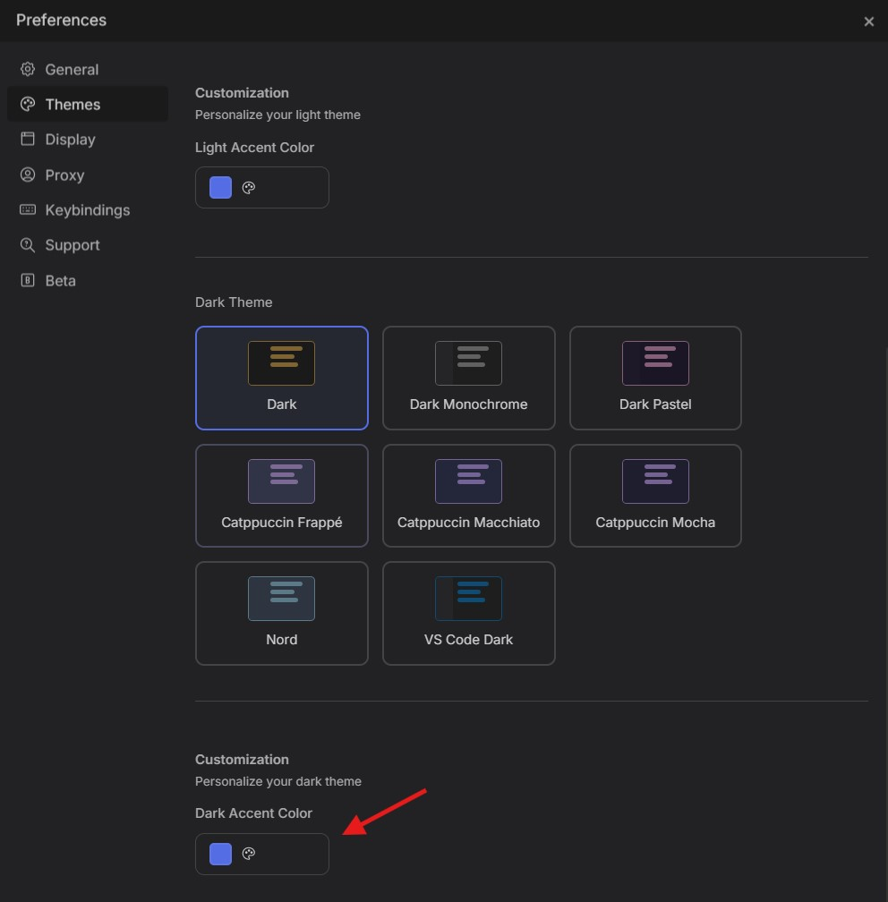
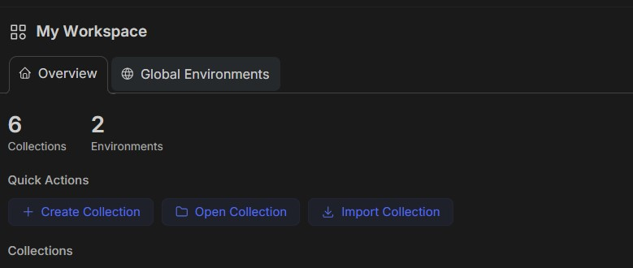
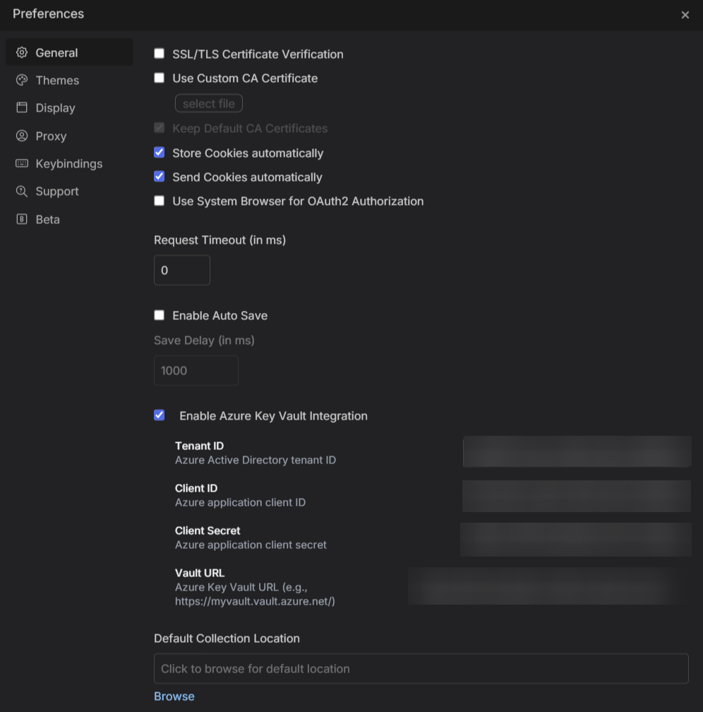
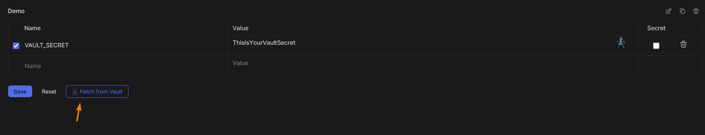
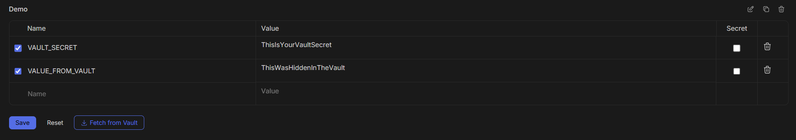

# RestWolf

## RestWolf - Personal Customized API Client

> **Note**: This is my personal customized version of Bruno where I have added features I want and modified it to suit my needs. I will not be fixing any logged bugs unless they directly affect me. This is not affiliated with the original Bruno project.

RestWolf is my personalized API client, forked from Bruno and enhanced with custom features.

## Development

This is a personal project. I make changes as I need them. Pull requests and/or Issues may or may not be accepted based on my personal needs.

## What have I added

The ability to change the accent colour.

The ability to use AzureVault.

## License 📄

[MIT](license.md)

---

**Original Project Credit**: This project is based on Bruno by [Anoop M D](https://www.helloanoop.com/). The original Bruno project can be found at <https://github.com/usebruno/bruno>
